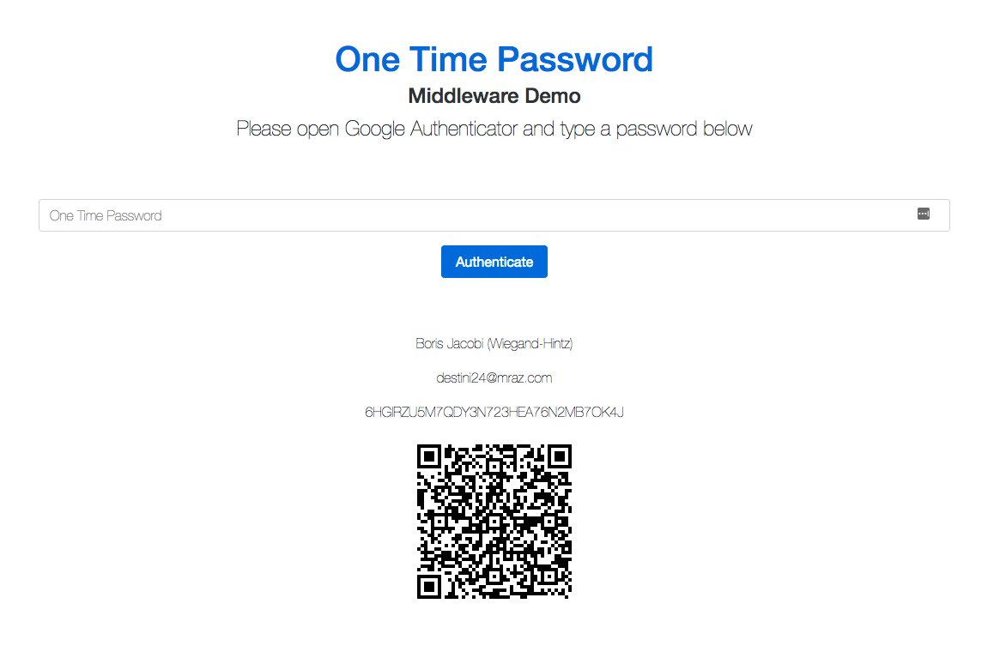

# Google2FA for Laravel

[](https://packagist.org/packages/pragmarx/google2fa) [](LICENSE) [](https://packagist.org/packages/pragmarx/google2fa) [](https://scrutinizer-ci.com/g/antonioribeiro/google2fa/?branch=master) [](https://styleci.io/repos/24296182)

### Google Two-Factor Authentication for PHP Package for Laravel

Google2FA is a PHP implementation of the Google Two-Factor Authentication Module, supporting the HMAC-Based One-time Password (HOTP) algorithm specified in [RFC 4226](https://tools.ietf.org/html/rfc4226) and the Time-based One-time Password (TOTP) algorithm specified in [RFC 6238](https://tools.ietf.org/html/rfc6238).

This package is a Laravel bridge to [Google2FA](https://github.com/antonioribeiro/google2fa)'s PHP package.

The intent of this package is to create QRCodes for Google2FA and check user typed codes. If you need to create backup/recovery codes, please check below.

### Recovery/Backup codes

if you need to create recovery or backup codes to provide a way for your users to recover a lost account, you can use the [Recovery Package](https://github.com/antonioribeiro/recovery). 

## Demos, Example & Playground

Please check the [Google2FA Package Playground](https://pragmarx.com/playground/google2fa#/).


Here's an demo app showing how to use Google2FA: [google2fa-example](https://github.com/antonioribeiro/google2fa-example).

You can scan the QR code on [this (old) demo page](https://antoniocarlosribeiro.com/technology/google2fa) with a Google Authenticator app and view the code changing (almost) in real time.

## Compatibility

| Laravel | [Google2FA](https://github.com/antonioribeiro/google2fa) | Google2FA-Laravel |
|---------|-----------|-------------------|
| 4.2     | <= 1.0.1  |                   |
| 5.0-5.1 | <= 1.0.1  |                   |
| 5.2-5.6 | >= 2.0.0  | >= 0.1.4          |

Before Google2FA 2.0 (Laravel 5.1) you have to install `pragmarx/google2fa:~1.0`, because this package was both a Laravel package and a PHP (agnostic).   

## Installing

Use Composer to install it:

    composer require pragmarx/google2fa-laravel

If you prefer inline QRCodes instead of a Google generated url, you'll need to install [BaconQrCode](https://github.com/Bacon/BaconQrCode):

    composer require bacon/bacon-qr-code

## Installing on Laravel

### Laravel 5.5

You don't have to do anything else, this package autoloads the Service Provider and create the Alias, using the new Auto-Discovery feature.

### Laravel 5.4 and below

Add the Service Provider and Facade alias to your `app/config/app.php` (Laravel 4.x) or `config/app.php` (Laravel 5.x):

``` php
PragmaRX\Google2FALaravel\ServiceProvider::class,

'Google2FA' => PragmaRX\Google2FALaravel\Facade::class,
```

## Publish the config file

``` php
php artisan vendor:publish --provider="PragmaRX\Google2FALaravel\ServiceProvider"
```

## Using It

#### Use the Facade

``` php
use Google2FA;

return Google2FA::generateSecretKey();
```

#### In Laravel you can use the IoC Container

``` php
$google2fa = app('pragmarx.google2fa');

return $google2fa->generateSecretKey();
```

## Middleware

This package has a middleware which will help you code 2FA on your app. To use it, you just have to:

## Demo

Click [here](https://pragmarx.com/google2fa/middleware) to see the middleware demo:



## Using the middleware

### Add the middleware to your Kernel.php:

``` php
protected $routeMiddleware = [
    ...
    '2fa' => \PragmaRX\Google2FALaravel\Middleware::class,
];
```

### Using it in one or more routes:

``` php
Route::get('/admin', function () {
    return view('admin.index');
})->middleware(['auth', '2fa']);
```

### Configuring the view

You can set your 'ask for a one time password' view in the config file (config/google2fa.php):

``` php
/**
 * One Time Password View
 */
'view' => 'google2fa.index',
```

And in the view you just have to provide a form containing the input, which is also configurable:

``` php
/**
 * One Time Password request input name
 */
'otp_input' => 'one_time_password',
```

Here's a form example:

```html
    <form action="/google2fa/authenticate" method="POST">
        <input name="one_time_password" type="text">

        <button type="submit">Authenticate</button>
    </form>
```

## One Time Password Lifetime

Usually an OTP lasts forever, until the user logs off your app, but, to improve application safety, you may want to re-ask, only for the Google OTP, from time to time. So you can set a number of minutes here:

``` php
/**
* Lifetime in minutes.
* In case you need your users to be asked for a new one time passwords from time to time.
*/

'lifetime' => 0, // 0 = eternal
```

And you can decider whether your OTP will be kept alive while your users are browsing the site or not:

``` php
/**
 * Renew lifetime at every new request.
 */

'keep_alive' => true,
```

## Manually logging out from 2Fa

This command wil logout your user and redirect he/she to the 2FA form on the next request:

``` php
Google2FA::logout();
```

If you don't want to use the Facade, you may:

``` php
use PragmaRX\Google2FALaravel\Support\Authenticator;

(new Authenticator(request()))->logout();
```

## Documentation

Check the ReadMe file in the main [Google2FA](https://github.com/antonioribeiro/google2fa) repository.

## Tests

The package tests were written with [phpspec](http://www.phpspec.net/en/latest/).

## Author

[Antonio Carlos Ribeiro](http://twitter.com/iantonioribeiro)

## License

Google2FA is licensed under the MIT License - see the `LICENSE` file for details

## Contributing

Pull requests and issues are more than welcome.
